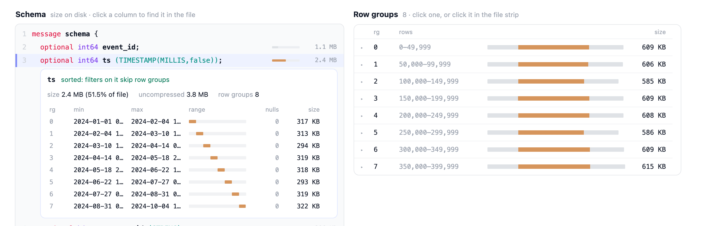
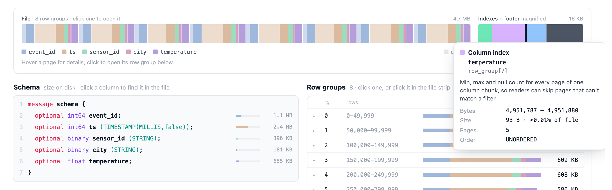
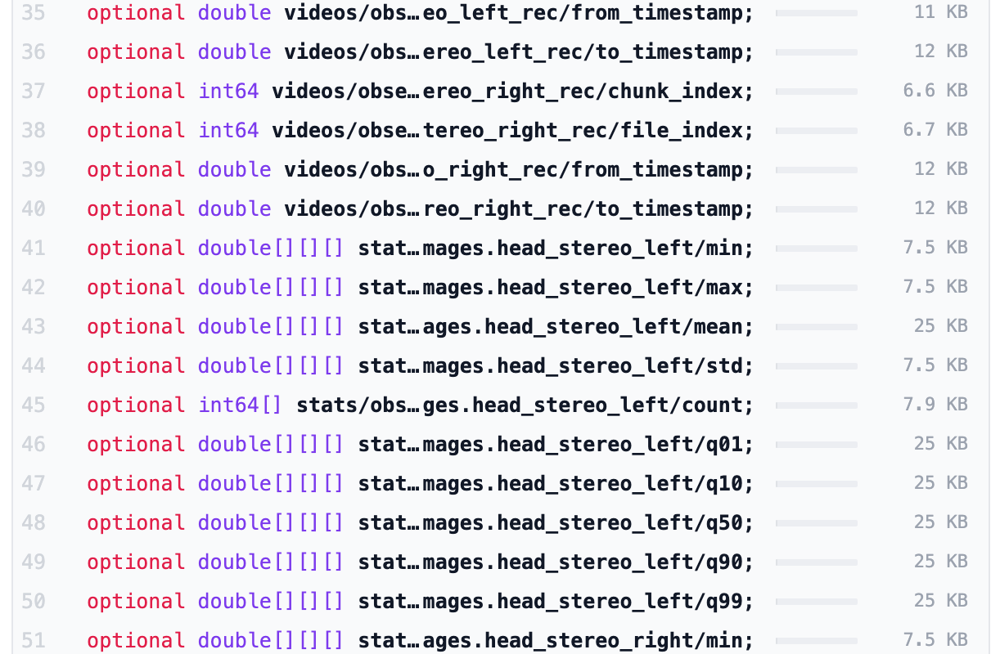
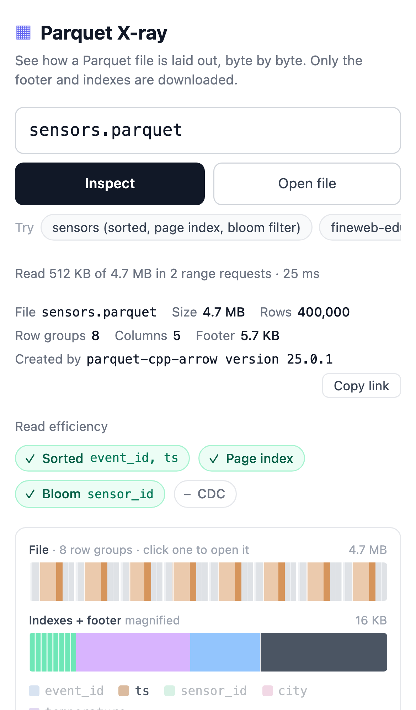
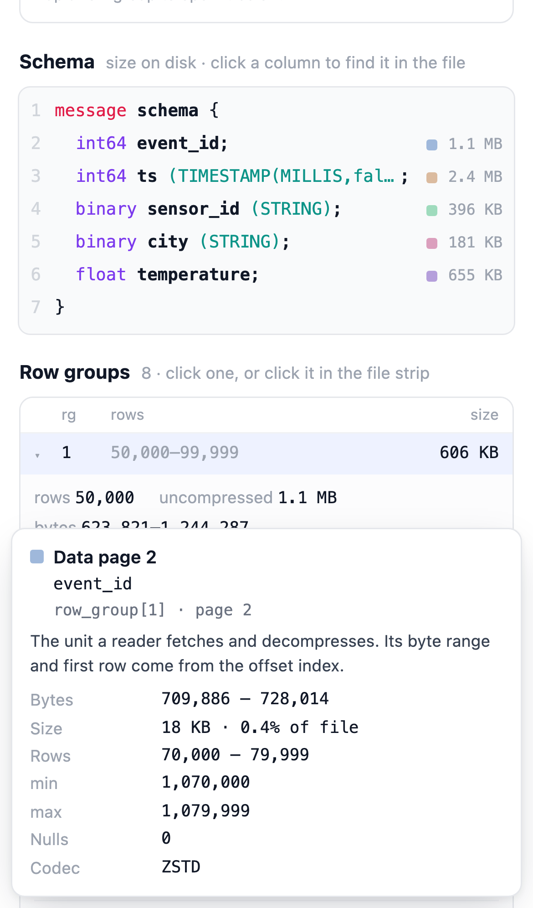

# Parquet X-ray

See how a Parquet file is laid out on disk: its row groups, column chunks, dictionary and data pages, page indexes, bloom filters and footer.

**[Open it on Hugging Face →](https://huggingface.co/spaces/cfahlgren1/parquet-xray)**


It only downloads the footer and the page indexes, so a 2 GB file opens after reading about 3 MB. Everything runs in your browser.

## What you can do

- **See the whole file at once.** Every row group sits at its real position and size, colored by column. Pale blocks are dictionary pages, stronger ones are data pages. The indexes and footer at the end are tiny, so they get their own magnified strip.
- **Hover anything.** A page shows its column, byte range, rows and min/max. An index or bloom filter explains what readers use it for.
- **Open a row group** from the strip or the list to see every column chunk split into its pages.
- **Click a column** in the schema to see its min/max in every row group. A sorted column climbs like a staircase; an unsorted one overlaps.
- **Check read efficiency at a glance.** Badges show whether range filters can skip row groups, whether there's a page index, which columns have bloom filters, and whether the file was written with content-defined chunking.
- **Share what you're looking at.** The file, row group and column are kept in the URL.

| Min/max per row group for a sorted column                                                              | The magnified indexes and footer                                    |
| ------------------------------------------------------------------------------------------------------ | ------------------------------------------------------------------- |
|  |  |

Nested columns stay readable: a `list<list<list<double>>>` is one line, `double[][][]`, instead of thirteen, and long names keep their ends visible so siblings that share a prefix can be told apart.



On a phone everything stacks into one column, and tapping a page opens its details as a bottom sheet.

<p>
  
  
</p>

## What it can open

| Input                                   | Example                                                                                   |
| --------------------------------------- | ----------------------------------------------------------------------------------------- |
| Hub file URL                            | `https://huggingface.co/datasets/openai/gsm8k/blob/main/main/test-00000-of-00001.parquet` |
| `hf://` path                            | `hf://datasets/openai/gsm8k/main/test-00000-of-00001.parquet`                             |
| Any URL that allows CORS range requests | `https://example.com/data.parquet`                                                        |
| A local file                            | **Open file**, or drop it on the page. It never leaves your browser.                      |

Links look like `?url=hf://datasets/openai/gsm8k/main/test-00000-of-00001.parquet&rg=0&col=answer`, and **Copy link** copies the current one.

## How it stays fast

The first request asks for the last 512 KB of the file (`Range: bytes=-524288`). That one response carries the file size, the footer and, for most files, the page indexes. A bigger footer takes a second request, and nothing else is fetched.

| File                               | Size   | Downloaded | Requests |
| ---------------------------------- | ------ | ---------- | -------- |
| sensors (page index, bloom filter) | 4.7 MB | 512 KB     | 1        |
| openai/gsm8k test split            | 409 KB | 409 KB     | 1        |
| fineweb-edu shard                  | 2.0 GB | 2.9 MB     | 2        |

Parsing uses [hyparquet](https://github.com/hyparam/hyparquet). The file strip is painted once to a canvas and hovering only redraws an outline, so files with hundreds of row groups stay smooth.

## Limitations

- Remote files need a server that allows cross-origin range requests. Hugging Face does.
- Very wide files (thousands of columns) render, but an open row group gets long.
- Min/max for text columns is whatever the writer stored, which is often truncated or missing.
- Encrypted files aren't supported.

## Development

```sh
npm install
npm run dev       # then open http://localhost:5173/?url=sensors.parquet
npm run verify    # lint, type-check, unit tests, build
```

It's Svelte 5, TypeScript and Vite. [CONTRIBUTING.md](CONTRIBUTING.md) explains where things live and which checks to run. `npm run screenshots` regenerates the images in this README.

## License

[Apache 2.0](LICENSE)
