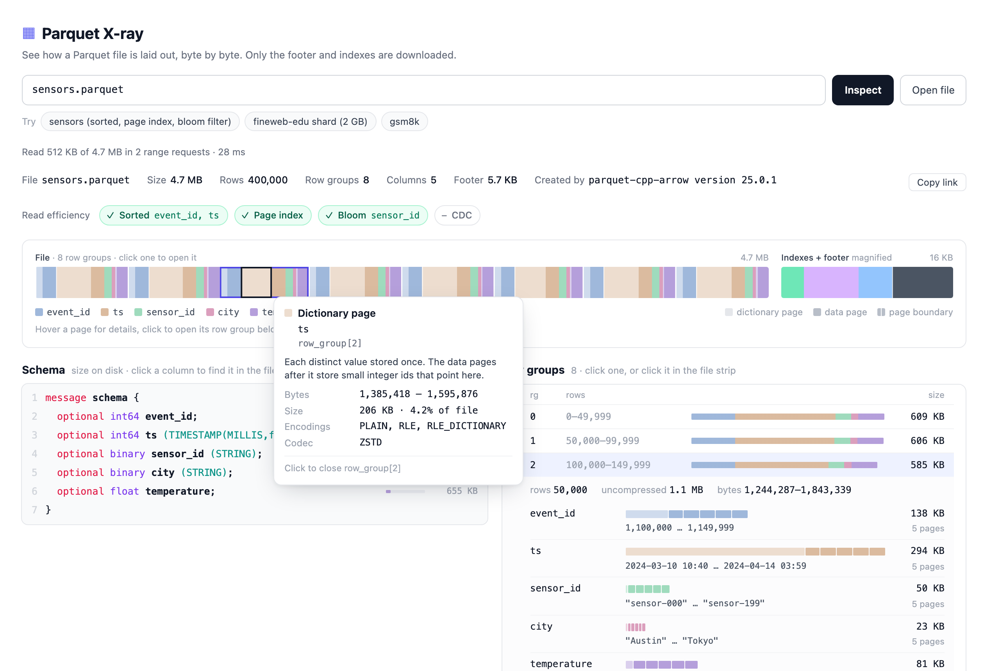

# Parquet X-ray

See how a Parquet file is laid out on disk: row groups, column chunks, pages, indexes, bloom filters and the footer.

**[Try it on Hugging Face →](https://huggingface.co/spaces/cfahlgren1/parquet-xray)**



Paste a Hub URL, an `hf://` path, any URL that allows CORS range requests, or open a local file. Only the footer and page indexes are downloaded, so a 2 GB file opens after reading about 3 MB. Parsing uses [hyparquet](https://github.com/hyparam/hyparquet).

## Development

```sh
npm install
npm run dev       # http://localhost:5173/?url=sensors.parquet
npm run verify    # lint, type-check, tests, build
```

See [CONTRIBUTING.md](CONTRIBUTING.md) for how the code is organized.

## License

[Apache 2.0](LICENSE)
